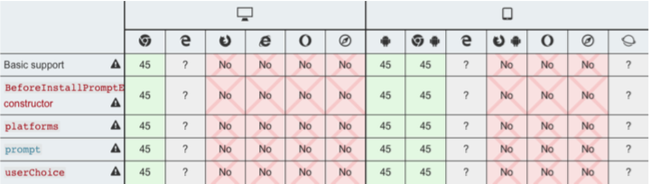
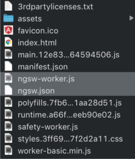
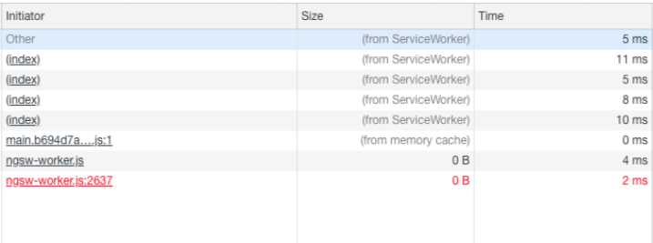
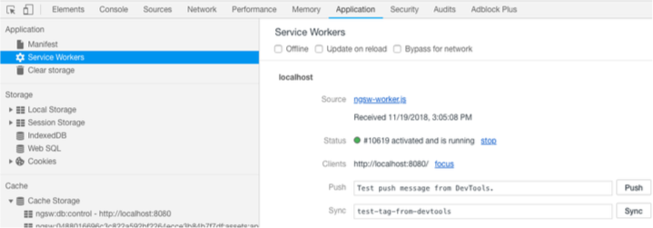
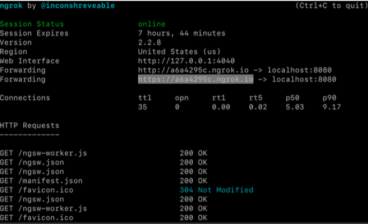
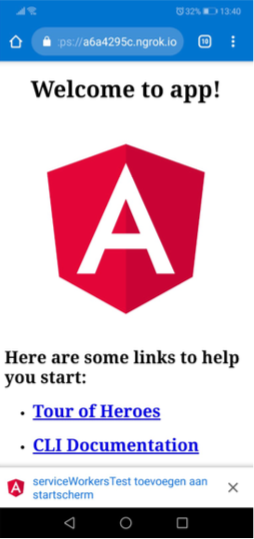
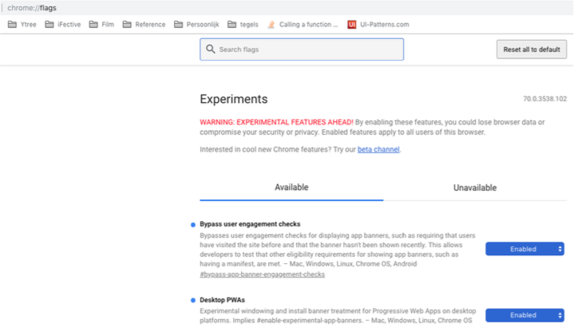
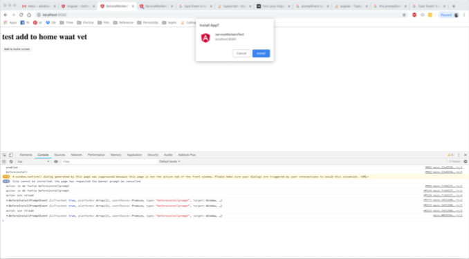
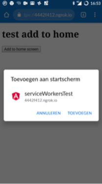

# pwa
In een wereld waar snelheid belangrijk is, mensen vaak haast hebben en zo snel mogelijk toegang willen hebben tot data is het belangrijk dat je als ontwikkelpartij applicaties ontwikkeld die snel toegankelijk zijn.

Maar wat als je core business het ontwikkel van webapplicaties is en de gebruiker altijd eerst de webbrowser moet opstarten, een url moet intypen en daarna pas de applicatie kan gebruiken? Welke mogelijkheden zijn er dan?

Webapplicaties worden namelijk in tegenstelling to native applicaties niet direct op het startscherm van de gebruiker geinstalleerd. Hierdoor zijn ze niet direct te gebruiken.

Uit onderzoek door Emerce B.V is gebleken dat wanneer de gebruiker een applicatie op zijn startscherm heeft geinstalleerd, deze de applicatie ook vaker gebruikt. Om precies te zijn 50 % meer als wanneer dit niet het geval is.

Gelukkig bieden modern browsers steeds meer ondersteuning om een “app-like experience” te simuleren. Een recent toegevoegde functionaliteit is bijv. “add to home screen”

**In dit blog gaan we onderzoeken of het mogelijk is om binnen een Angular applicatie een knop toe te voegen welke mobiele en tablet gebruikers de mogelijkheid biedt de applicatie toe te voegen aan zijn/haar startscherm.**

## De mogelijkheden van Angular

Binnen Angular is er niet een standaard of een API die het mogelijk maakt om een “add to homescreen” functionaliteit toe te voegen. Wel is is het mogelijk de applicatie om te zetten naar een PWA.

PWA staat voor Progressive Web App (hierna: PWA). PWA’s zijn een mooie manier om er voor te zorgen dat een webapplicatie zich gaat gedragen als een native applicatie. Hierdoor krijgt de gebruiker een “app-like experience”.

Een PWA is nog steeds een webapplicatie alleen heeft deze de look en feel van een native app. Ze zijn progressief, online en offline te gebruiken altijd up to date en veilig. En net als gewone websites vindbaar in zoekmachines en te benaderen via een url.

In tegenstelling tot een native app, hoef je een webapplicatie niet eerst te downloaden om op je telefoon / tablet te gebruiken. In plaats daarvan maak je vanuit je browser een snelkoppeling aan op het startscherm van de telefoon. Vanuit hier kun je via de snelkoppeling eenvoudig en snel de applicatie openen. Dit is bijna dezelfde experience als wanneer je een native app download vanuit de store.

Echter niet elke gebruiker is op de hoogte van deze “add to home screen” functionaliteit of weet hoe dit moet. Hoe zorg je er voor dat gebruikers hier van op de hoogte zijn? Hoe kun je er voor zorgen dat een gebruiker van een webapplicatie deze “app-like experience” ervaart?

## Een Angular app omzetten naar een PWA

Om de gebruiker de mogelijkheid te bieden de webapplicatie toe te voegen aan zijn startscherm moet je deze eerst omzetten naar een PWA. Deze PWA moet voldoen aan een aantal criteria.

- De pwa mag nog niet zijn geinstalleerd
- De gebruiker moet minimal 30 seconden actief zijn op het domein
- De pwa moet een manifest file hebben met daarin
    - short_name of name
    - icons ( 192px en 512px icoon zijn verplicht)
    - start_url
    - display moet zijn: fullscreen, standalone of minimal-ui
- De pwa moet geserved worden over HTTPS
- Service workers moeten geregistreerd worden met een fetch event handler

Wanneer aan deze criteria word voldaan zal Google Chrome een beforeinstallprompt event afvuren welke gebruikt kan worden de gebruiker een bericht te sturen met daarin de vraag of deze de pwa wil toe voegen aan het startscherm.

**N.B.** *Belangrijk om te rekening mee te houden is dat browsers zoals Edge, Firefox, Opera, Safari, Samsung internet en UC Browser andere criteria hanteren en het beforeinstallprompt event niet triggeren. Zoals op de “ afbeelding 1” is te zien is de support voor dit event laag en word dit momenteel alleen ondersteund in Chrome en Android browser.*

Wanneer een bezoeker in Chrome voor de tweede keer in twee weken tijd de PWA bezoekt, krijg hij een ‘Add to homescreen’ melding. Door hier op te klikken, wordt de PWA door middel van een snelkoppeling toegevoegd aan het startscherm.

***Afbeelding. 1***

Hoe zorgen we er voor dat onze Angular applicatie voldoet aan deze criteria, wat moeten we hier voor doen? Voor het gemak maken we gebruik van de angular CLI

### Stap 1

- navigeer m.b.v cmd naar de juiste folder
- voer het volgende command uit: ***ng add @angular/pwa*** 

***Dit commando:***
- voegt de service worker package toe aan het angular project
- Ondersteund build support voor service workers binnen de CLI
- Voegt de property ***serviceWorker: true*** toe aan de prod build (angular.json)
- Registreerd service workers in app module
    - Wanneer je een base-href gebruikt moet je het pad veranderen van /ngsw- worker naar ./ngsw-worker
- Update de index.html
    - Er word een link toegevoegd naar manifest.json 
    - Er word een meta tag toegevoegd ,<meta name=”theme-color”>`
- Er word een icons folder aan de assets toegevoegd
- Er word een service worker configuratie bestand gegenereerd (ngsw-config.json)

Als laatste moet het project nog gebouwd worden ***( ng build –prod )*** dit omdat service workers alleen werken in de production build. Als alles goed is gegaan is er nu een build gemaakt van het project en staan de bestanden in de in de ***dist*** folder.

Zoals je hieronder op “afbeelding 2” kunt zien staan er na het uitvoeren van het build commando nu 2 extra files in de dist folder, nl. ngsw-worker.js en ngsw-json

***Afbeelding. 2***

### Stap 2

Omdat het commando ng serve ***niet*** werkt in combinatie met service workers is het nodig om een aparte HTTP Server te installeren zodat je het project lokaal kunt testen. Om de server te installeren volg de volgende stappen:

- `npm install http-server –g`
- cd naar het angular project via de CLI
- Start de server via de CLI met het volgende command: `http-server -p 8080 -c-1
dist/<project-naam>`
    - de –c-1 optie disabled server caching
    - de server draait normal op poort 8080 wanneer deze geblocked is zal de
applicatie een opvolgend nummer kiezen bijv: 8081
    - Als er lokaal een rest api server draait bijv op poort 9000 dan kun je deze ook
gebruiker m.b.v de proxy flag: http-server -c-1 --proxy `http://localhost:9000`

Nu de server draait kun je het adres ( localhost:8080 ) invoeren in de browers. De applicatie zal laden zoals normal ook het geval met ng-serve is.

***N.B.*** *Wanneer je service workers wil testen is het een goed idee om dit in incognito modus te doen. Dit om er zeker van te zijn dat service workers niet word gecached*

Wanneer we navigeren naar localhost:8080 kun je zien dat de applicatie normal opstart. Om de service workers te testen moeten we de netwerkverbinding onderbreken en een offline omgeving simuleren. Dit kunnen we doen met behulp van de inspector.

Open de inspector en navigeer naar de tab netwerk. Hier vind je een checkbox offline. Vink deze aan en ververs de pagina. Als alles goed is gegaan word de applicatie ook zonder internetverbinding geladen. Dit komt omdat de service worker de bestanden heeft gecached.

***Afbeelding. 3***

Zoals we kunnen zien op “afbeelding 3” size kolom, worden de bestanden opgehaald door de service worker (from serviceWorker) Dit betekend dat service workers werken. Wat de service worker cached word bepaald door ngsw-config.json. In dit bestand kun je aangeven de welke paden / bestanden gecached moeten worden.

***Afbeelding. 4***

***N.B.*** *In de inspector onder de application tab “afbeelding 4” is meer informatie te vinden over de service worker. Ook vind je hier informatie over het manifest, storage en caching.*

### Stap 3

Als alles goed is gegaan draait de HTTP server nu lokaal. Om service workers te laten werken moet de pwa geserved worden over HTTPS. Alleen dan kunnen we testen of we de melding zien. Om dit mogelijk te maken kunnen we gebruik maken van ngrok

***N.B.*** *ngrok “afbeelding 5” maakt het mogelijk om een locale url te poorten naar een publiek adres. Dit is tegerlijk ook een HTTPS adres. Op deze manier kunnen we direct testen of de service worker werkt.*

- Download ngrok.
- Als ngrok gedownload is moeten we de locale url publiekelijk maken dit doen we met
het volgende commando: `ngrok http 8080 -host-header="localhost:8080"`

***Afbeelding. 5***

ngrok word gestart en zoals je kunt zien op “afbeelding 5” krijgen we een HTTPS url terug. Wanneer we dit adres bekijken op een mobiel apparaat krijgen we naar 30 seconden netjes de melding “afbeelding 6” of we de pwa toe willen voegen aan ons startscherm.

***Afbeelding. 6***

Deze melding “serviceWorkers toevoegen aan startscherm” word default getoont. Dit omdat er word voldaan aan de criteria welke aan een pwa binnen Chrome worden gesteld. Het probleem is alleen dat wanneer de gebruiker besluit deze melding weg te klikken de vraag of de gebruiker de app wil toevoegen aan het startscherm pas 3 maanden later opnieuw word gesteld.

## Een custom install knop toevoegen

Om er voor te zorgen dat de gebruiker zelf kan bepalen wanneer hij de PWA toevoegd aan zijn startscherm moeten we een knop toevoegen die deze functionaliteit afhandeld.

Vanaf Chrome versie 68, is er een event wat elke keer word getriggerd wanneer de gebruiker de PWA opstart. Dit is het beforeinstallprompt event. Dit event kan worden gebruikt om een custom install button te maken waarmee de applicatie kan worden toegevoegd aan het startscherm van de gebruiker.

Door gebruik te maken van een knop word de keuze over gelaten aan de gebruiker. Deze kan nu zelf bepalen wanneer hij de applicatie wil toevoegen aan het startscherm. In de bijgevoegde bestanden is deze code te bekijken.

***app.compontent.html***
In het HTML bestand voegen we een button toe die de gebruiker kan gebruiken om de pwa toe te voegen aan zijn startscherm. De knop maakt gebruik van het click event met daaraan een method installPwa gekoppeld. Wanneer de gebruiker op de knop klikt word deze method afgevuurd.

***app.compontent.ts***
In het bijbehorende component vangen we de installPwa method af en maken we gebruik van de PwaService om het prompt event te triggeren. Bovenin includen we de PwaService.

***pwa.service.ts***
In de PwaService luisteren we naar het beforeinstallprompt event. Dit event plaatsen we in de constructor zodat er direct naar dit event word geluisterd. Bovenin includen we de module BeforeInstallPromptEvent (dit is niet echt een module maar meer een type definitie).

***BeforeInstallPromptEvent.ts***
Het beforeinstallpromptevent is niet een standard event binnen Angular en word momenteel alleen ondersteund door Chrome en Android. Ook is het geen officiele type definitie binnen Typescript. Daarom is het nodig om dit type zelf te definieren.

Wanneer je nu op de knop klikt gebeurt er op desktop nog niks. Dit is omdat de nieuwste versie van Chrome deze pwa functionaliteiten standard heeft uitgeschakeld. Momenteel vallen deze nog onder de “experimentele settings”. Om gebruik te maken van deze functionaliteiten en om te testen of de knop werkt kun je het volgende doen:

- ga naar chrome://flags
- enable Bypass user engagement checks
- enable Desktop PWAs

***Afbeelding. 7***

Wanneer je nu op de knop klikt zie je de volgende melding op desktop

***Afbeelding. 8***

Dezelfde melding alleen nu op mobiel

## Conclusie

Om terug te komen op de vraag of het mogelijk is om binnen een Angular applicatie een knop toe te voegen welke mobiele en tablet gebruikers de mogelijkheid biedt de webapplicatie toe te voegen aan zijn/haar startscherm is het antwoord ja, maar...

Momenteel word het beforeinstallpromptevent namelijk alleen in Chrome en Android browsers ondersteund. De overige browsers zoals Edge, Firefox, Opera, Safari, Samsung internet en UC Browser hanteren nl. andere criteria en hier word het `beforeinstallpromptevent` niet

aangeroepen. Het is daarom ***niet*** mogelijk om in deze browsers een “custom knop” toe te voegen waarmee de gebruiker de applicatie kan toevoegen aan zijn startscherm.

Wel kun je er voor zorgen dat in deze browsers de PWA een “app-like experience”heeft. Denk hierbij aan een splash screen bij het opstarten of een custom icoon wanneer je de applicatie handmatig toevoegt aan het startscherm. Dit kun je realiseren door de webapp om te zetten naar een PWA. Echter de manieren om dit crossplatform te laten werken verschilt ook.

Een custom install knop is een mooie manier om gebruikers te verleiden de applicatie toe te voegen aan hun startscherm waardoor deze meer word gebruikt. Echter is de ondersteuning hiervoor nog laag en zullen we moeten wachten todat ook de andere browsers het `beforeinstallpromptevent` kunnen herkennen. Voorlopig zul je per browser moeten checken welke mogelijkheden deze bied om een een “app-like experience” te simuleren.

*Wilt u meer informatie hierover? Neem dan contact met ons op via telefoon: 085-0443333 of via email: info@ifective.nl*